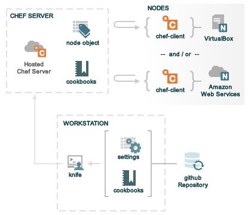

!SLIDE
# Hello World

Section Objectives

* Walk through basic Chef configuration workflow
* Install and configure fortune on node

!SLIDE
# Your setup

You have three instances dedicated for your use in this class:

* Chef 11 Server / Workstation (CHEFSERVER)
* Ubuntu 12.04 Node (NODE1)
* CentOS 5.7 Node (NODE2)

For the first few hands-on exercises, we will just be using the Chef Server and the Ubuntu node.

!SLIDE
# Chef organization overview

!SLIDE
# List nodes

SSH to your Chef Server.

    > ssh chefadmin@CHEFSERVER

Use `knife node list` to list all the node objects on the Chef Server.

    > knife node list

!SLIDE
# Bootstrap chef-client on node

Integrating a new node into the infrastructure is easy with `knife
bootstrap`.

    > sudo knife bootstrap NODE1 --sudo \
      -x chefadmin -P violinrocks
    Bootstrapping Chef on NODE1
    [lots of stuff]
    Thank you for installing Chef!
    Chef Client finished, 0 resources updated

!SLIDE
# List nodes

    > knife node list
    NODE1_FQDN

!SLIDE
# What did you do?

You installed chef-client on a node!

!SLIDE
# Investigating further

    > ssh chefadmin@NODE1
    
    > ls /etc/chef
    client.pem     client.rb     first-boot.json
    validation.pem
    
    > ls -al /usr/bin/chef*
    /usr/bin/chef-client ->
      /opt/chef/bin/chef-client
    
    > exit

!SLIDE
# Create Chef Git Repository

    > git config --global user.name "Your Name"
    > git config --global user.email you@example.com

    > git clone https://github.com/opscode/chef-repo.git
    > cd chef-repo
    > rm -rf .git
    > rmdir coobkooks/hadoop-demo # Some cruft 7 Feb 2013
    > git init
    > git add .
    > git commit -m "Initial Chef Repository"

!SLIDE
# Chef 11 needs cookbook_path

    > cd ~/chef-repo/cookbooks
    > echo "cookbook_path '`pwd`'" | sudo tee -a ~/.chef/knife.rb
    > less ~/.chef/knife.rb
    > cd ..

!SLIDE
# Verify knife.rb works

    > cd ~/chef-repo

    > knife node list

!SLIDE
# Download Cookbook from Community site

    > knife cookbook site download fortune
    Downloading fortune from the cookbooks site at version 0.0.1
     to /home/chefadmin/chef-repo/fortune-0.0.1.tar.gz
    Cookbook saved: /home/chefadmin/chef-repo/fortune-0.0.1.tar.gz

!SLIDE
# Extract and view Cookbook

    > tar xzvf fortune*.tar.gz -C cookbooks
    > less cookbooks/fortune/README.md
    > less cookbooks/fortune/recipes/default.rb
    package "fortune" do
      action :install
    end

!SLIDE
# http://docs.opscode.com

<a href="http://docs.opscode.com/resource.html">http://docs.opscode.com/resource.html</a>
<a href="http://docs.opscode.com/resource_package.html">http://docs.opscode.com/resource_package.html</a>

!SLIDE
# Version control in SCM repository

    > echo "*.tar.gz" >> .gitignore
    > git add .gitignore cookbooks/fortune/*
    > git commit -m "Adding fortune cookbook"

!SLIDE
# Upload cookbook to Chef Server
    > sudo knife cookbook upload fortune
    Uploading fortune       [0.0.1]
    Uploaded 1 cookbook.

Visit http://CHEFSERVER

!SLIDE
# Runlist

    > export EDITOR=vi
    > knife node list
    > knife node edit NODE1
    {
      "name": "NODE1",
      "chef_environment": "_default",
      "normal": {
        "tags": [
        ]
      },
      "run_list": [
        "recipe[fortune]"
      ]
    }

!SLIDE
# Run chef-client on node

    > ssh chefadmin@NODE1
    > sudo chef-client
    [lots of stuff]
    Chef Client finished, 1 resources updated

!SLIDE
# Try it out!

    > fortune

!SLIDE
# Run chef-client AGAIN
    > sudo chef-client
    [some stuff]
    Chef Client finished, 0 resources udpated

    > exit

!SLIDE smaller
# Summary

List nodes

    > knife node list

Bootstrap node

    > sudo knife bootstrap NODE_IP -- sudo \
      -x USERNAME -P PASSWORD
    > sudo knife bootstrap NODE_IP -i PUBKEY

Knife cookbook workflow

    > knife cookbook site download COOKBOOK_NAME
    > tar xzvf COOKBOOK_TAR_GZ -C cookbooks
    > sudo knife cookbook upload COOKBOOK_NAME
    > knife node edit NODE_NAME

!SLIDE
# Summary (contd.)

Initiate chef run

    > sudo chef-client
    > sudo chef-client --log debug
