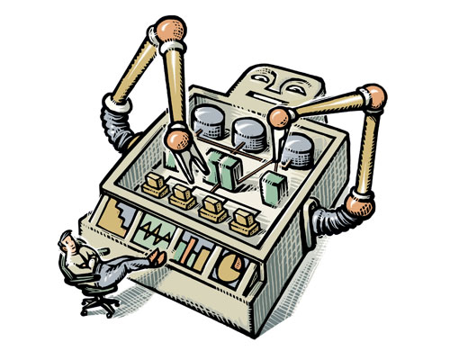
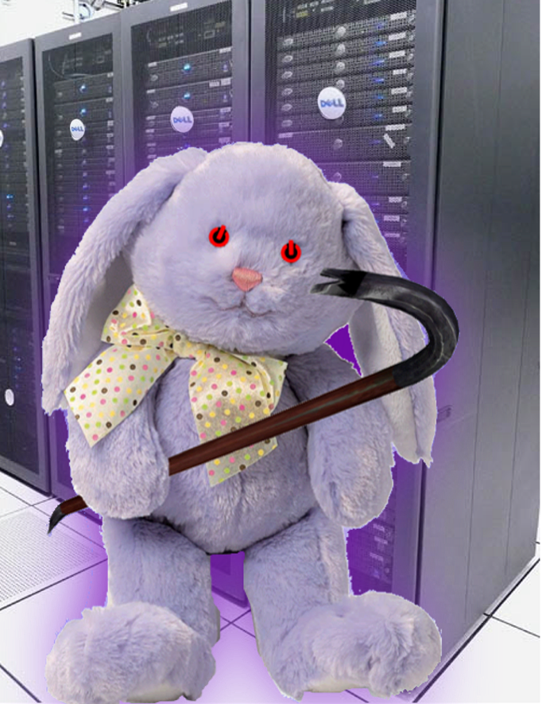

# Welcome to Chef Fundamentals!

Mischa Taylor - 8 Feb 2013

Created and Curated by Opscode, Inc.

.notes These course materials are Copyright © 2010-2012 Opscode,
Inc. All rights reserved.  This work is licensed under a Creative
Commons Attribution Share Alike 3.0 United States License. To view a
copy of this license, visit
http://creativecommons.org/licenses/by-sa/3.0/us; or send a letter to
Creative Commons, 171 2nd Street, Suite 300, San Francisco,
California, 94105, USA.

# Expectations

* We will be doing a lot of hands-on exercises
* Focus on being immediately productive without writing much code
* Introduce terminology/concepts as we go
* You should leave this class confident that you can automatically configure & deploy a system with Chef

# What is Chef good for?

Automating system configuration

# Infrastructure as Code

* System configuration expressed by a collection of small text configuration files
* Version-controlled with the same source code management tools developers use

# Facebook Likes Chef

# Dell Crowbars Chef

# I already use VMs, Why Should I care?

Virtual Machines are....

* Gigantic compared to text files
* Not easily reproduced in other enviornments (bare metal, cloud, other hypervisors)
* Not easy to patch/update after being initially configured
* Prone to configuration drift (even with snapshots)

# And there's more!

* Platform abstraction - Use the same set of configuration files to configure CentOS, Ubuntu, and Windows
* Reusable - Once someone has figured out how to express a setup as configuration files, they can be resued
* Data-driven deployments - Scripts can react to environmental changes as configuration scripts run
